  

  
  
  
  

 

## `~/about`

## `~/projects`

| Repository | What it solves | Stack |
| :--- | :--- | :--- |
| **[VoxBridge](https://github.com/NimaHamedIman/VoxBridge)** | Voice-first assistant for people who are excluded by keyboard-driven interfaces | Python · FastAPI · Whisper · Groq · SQLite · Nginx · systemd |
| **[private-vpn-infrastructure](https://github.com/NimaHamedIman/private-vpn-infrastructure)** | Reliable, private internet access from a network with active DPI | Ubuntu · Xray/REALITY · Nginx · Cloudflare · UFW · fail2ban |

> Both repositories document the **architecture, the trade-offs and the failures** — not only the code.

## `~/stack`

## `~/contact`

**[GitHub](https://github.com/NimaHamedIman)** · **[LinkedIn](https://www.linkedin.com/in/nima-hamediman-827a733b4/)** · **[E-Mail](mailto:nima.1923.hamediman@gmail.com)**

Hamburg, Germany — offen für Werkstudent, Praktikum und Junior-Positionen.

